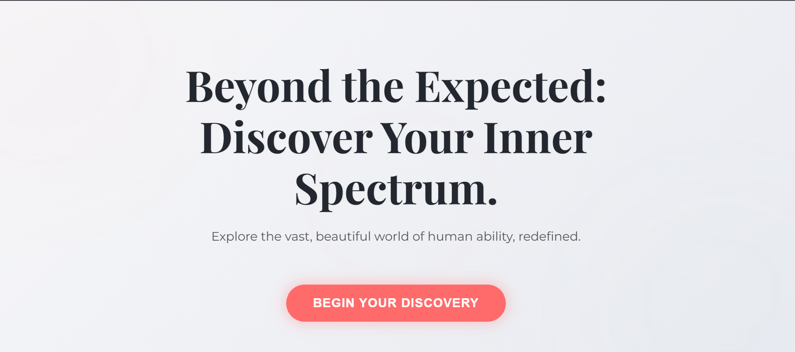
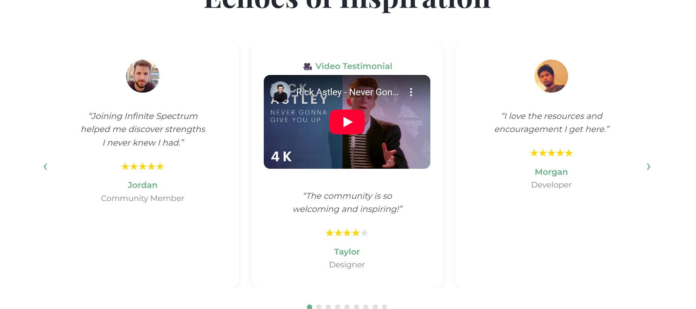
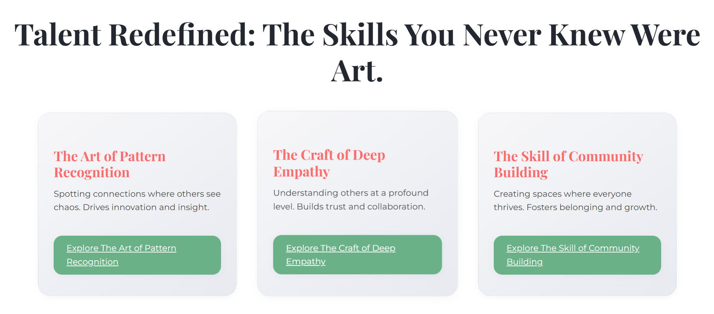
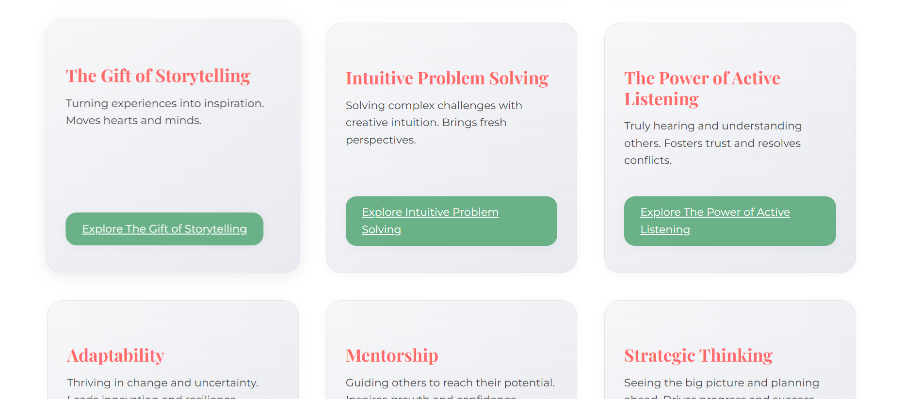

# Infinite Spectrum Landing Page

Discover and celebrate the quiet vibrancy of human talent.  
**Infinite Spectrum** is a modern, responsive landing page built with React, designed to inspire, connect, and empower.

 <

---

## 🚀 Live Demo

[View on Vercel](https://your-vercel-link.vercel.app)

---

## ✨ Features

- Modern, responsive design
- Animated hero, gallery, and testimonials
- Talent gallery with detail pages
- Journey steps with learn-more navigation
- Explore hub with categories and profile detail pages
- Interactive, conversion-focused signup section
- Confetti and testimonial slider for engagement
- FAQ accordion and social proof
- Accessible and mobile-friendly
- Built with ❤️ by [Akano Teslim Ayomide](teslimakano20@gmail.com)

---

## 🖼️ Screenshots






---

## 🛠️ Tech Stack

- [React](https://reactjs.org/)
- [Framer Motion](https://www.framer.com/motion/)
- [react-confetti](https://github.com/alampros/react-confetti)
- [react-router-dom](https://reactrouter.com/)
- [Vercel](https://vercel.com/) for deployment

---

## 📦 Getting Started

1. **Clone the repo:**
   ```sh
   git clone https://github.com/teshcodes/infinite-spectrum-lp.git
   cd infinite-spectrum-lp
   ```

2. **Install dependencies:**
   ```sh
   npm install
   ```

3. **Start the development server:**
   ```sh
   npm start
   ```

4. **Build for production:**
   ```sh
   npm run build
   ```

---

## 📬 Contact

- Email: [your@email.com](teslimakano20@gmail.com)
- [Facebook](https://facebook.com/teshcodes)
- [Instagram](https://instagram.com/tesh_devs)
- [TikTok](https://tiktok.com/@teshcodes)

---

## 📝 License

This project is open source and available under the [MIT License](LICENSE).

---

## 🙋‍♂️ Author

Built with passion by  
**Akano Teslim Ayomide**  


---
